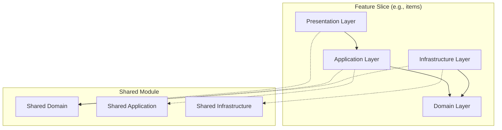

# Architecture Overview

This document provides a high-level overview of the system architecture,
technology choices, and structural organization.

## Vertical Slice Architecture with Clean Architecture

This application combines two architectural patterns:

1. **Vertical Slice Architecture**: Features are organized as self-contained
   slices, each containing all layers needed for that feature. This promotes
   high cohesion within features and loose coupling between them.

2. **Clean Architecture**: Within each slice, code is organized in layers with
   dependencies pointing inward toward the domain. The domain layer has no
   external dependencies.



## Layer Responsibilities

| Layer              | Responsibility                             | Examples                       |
| ------------------ | ------------------------------------------ | ------------------------------ |
| **Presentation**   | HTTP handlers, request/response mapping    | Hono route handlers            |
| **Application**    | Use cases, orchestration, DTOs, validation | Services, Zod schemas          |
| **Domain**         | Business logic, entities, value objects    | Entities extending BaseEntity  |
| **Infrastructure** | External concerns, data access             | Repositories, database queries |

## Technology Stack

| Technology     | Purpose                                                                     |
| -------------- | --------------------------------------------------------------------------- |
| **Deno**       | Runtime environment with built-in TypeScript support, security-first design |
| **Hono**       | Lightweight, fast web framework for HTTP routing and middleware             |
| **Kysely**     | Type-safe SQL query builder for database operations                         |
| **Zod**        | Schema validation for input data and DTOs                                   |
| **fast-check** | Property-based testing for correctness verification                         |

## Project Structure

```
src/
├── features/                    # Feature slices (self-contained)
│   └── [feature-name]/          # Each feature follows vertical slice pattern
│       ├── domain/              # Entities, value objects, errors
│       ├── application/         # Use cases, DTOs, validation schemas
│       ├── infrastructure/      # Repositories, external services
│       └── presentation/        # HTTP handlers, routes
├── shared/                      # Shared code across features
│   ├── domain/                  # BaseEntity, Result type, common errors
│   ├── application/             # Validation utilities
│   ├── infrastructure/          # Mappers, middlewares, logger
│   └── presentation/            # Common HTTP utilities
└── server.ts                    # Application entry point

test/                            # Test suite mirroring src/ structure
├── shared/                      # Tests for shared modules
└── features/                    # Tests for feature slices
```

## Shared Module

The `src/shared/` module contains code reused across feature slices:

- **shared/domain**: `BaseEntity`, `BaseRepository` interface, `Result` type,
  domain errors
- **shared/application**: `validate()` function for Zod schema validation
- **shared/infrastructure**: Case mappers (`mapRowToEntity`, `mapEntityToRow`),
  logging, middlewares

Feature slices depend on shared modules but never on each other directly.
Cross-slice communication uses interfaces defined in the shared module.
