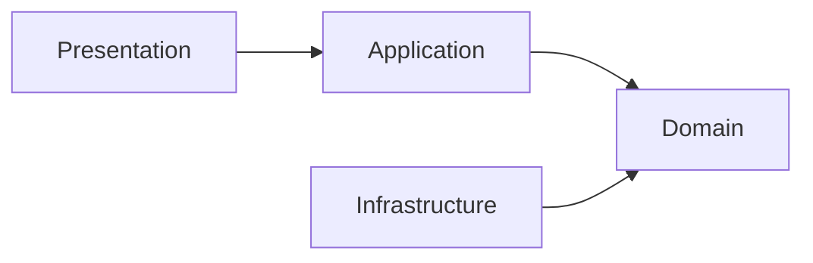

# Architecture Principles

Core design principles guiding all development decisions in this project.

## 1. Dependency Rule

Dependencies must point inward toward the domain layer. The domain layer has no dependencies on outer layers.



**DO:**
```typescript
// Application layer imports from domain
import { Result } from "#/shared/domain/result.ts";
import { User } from "#/features/auth/domain/user.entity.ts";
```

**DON'T:**
```typescript
// Domain layer should NOT import from infrastructure
import { db } from "#/shared/infrastructure/database.ts"; // ❌ Wrong!
```

## 2. Result Type Pattern

Use the `Result<T, E>` type for all operations that can fail. Never throw exceptions for business logic errors.

**DO:**
```typescript
function findUser(id: string): Promise<Result<User | null, DomainError>> {
  const user = await repository.findById(id);
  if (!user) {
    return Result.err(new NotFoundError("User", id));
  }
  return Result.ok(user);
}

// Caller handles the result
const result = await findUser(id);
if (result.isErr()) {
  return result; // Propagate error
}
const user = result.value; // Safe to access
```

**DON'T:**
```typescript
function findUser(id: string): Promise<User> {
  const user = await repository.findById(id);
  if (!user) {
    throw new Error("User not found"); // ❌ Don't throw for business logic
  }
  return user;
}
```

## 3. Soft Deletion Strategy

Records are never physically deleted. Instead, set the `deletedAt` timestamp.

**DO:**
```typescript
async delete(id: string): Promise<Result<boolean, DomainError>> {
  await db
    .updateTable("users")
    .set({ deleted_at: new Date() })
    .where("id", "=", id)
    .execute();
  return Result.ok(true);
}

// Always filter out deleted records in queries
async findAll(): Promise<Result<User[], DomainError>> {
  const rows = await db
    .selectFrom("users")
    .where("deleted_at", "is", null)
    .execute();
  return Result.ok(rows.map(mapRowToEntity<User>));
}
```

**DON'T:**
```typescript
async delete(id: string): Promise<void> {
  await db.deleteFrom("users").where("id", "=", id).execute(); // ❌ Physical deletion
}
```

## 4. Case Mapping Convention

Database columns use `snake_case`, TypeScript code uses `camelCase`. Use case mappers for conversion.

| Context | Convention | Example |
|---------|------------|---------|
| Database columns | snake_case | `created_at`, `user_id` |
| TypeScript properties | camelCase | `createdAt`, `userId` |
| File names | kebab-case | `user-repository.ts` |
| Classes/Interfaces | PascalCase | `UserEntity`, `CreateUserDTO` |

**DO:**
```typescript
import { mapRowToEntity, mapEntityToRow } from "#/shared/infrastructure/mappers/index.ts";

// Database → Entity
const user = mapRowToEntity<User>(row); // { created_at: ... } → { createdAt: ... }

// Entity → Database
const row = mapEntityToRow(user); // { createdAt: ... } → { created_at: ... }
```

## 5. Immutability

Prefer immutable data structures. Use `readonly` for properties that shouldn't change after construction.

**DO:**
```typescript
class User extends BaseEntity {
  readonly email: string;
  readonly name: string;
  
  constructor(props: UserProps) {
    super(props);
    this.email = props.email;
    this.name = props.name;
  }
}
```

## 6. Single Responsibility

Each module should have one reason to change. Separate concerns into distinct files and classes.

- Entities contain business logic only
- Repositories handle data access only
- Use cases orchestrate operations only
- Handlers map HTTP requests/responses only
