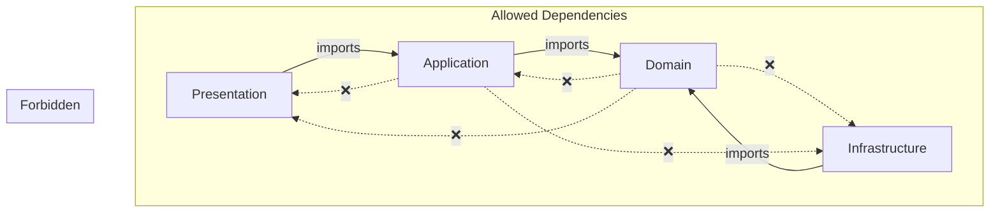

# Module Boundaries

Dependency rules between modules and layers.

## Layer Dependency Diagram



## Allowed Imports Per Layer

### Domain Layer

The domain layer is the core and has **no dependencies** on other layers.

**Allowed imports:**
- Other domain files within the same feature
- Shared domain (`#/shared/domain/`)
- Standard library types

**Forbidden imports:**
- Application layer
- Infrastructure layer
- Presentation layer
- External libraries (except type definitions)

```typescript
// ✅ Allowed in domain
import { BaseEntity } from "#/shared/domain/entity.ts";
import { Result } from "#/shared/domain/result.ts";
import { DomainError } from "#/shared/domain/errors.ts";

// ❌ Forbidden in domain
import { validate } from "#/shared/application/validation.ts";
import { db } from "#/shared/infrastructure/database.ts";
import { Hono } from "hono";
```

### Application Layer

**Allowed imports:**
- Domain layer (same feature and shared)
- Shared application (`#/shared/application/`)
- External libraries for validation (Zod)

**Forbidden imports:**
- Infrastructure layer
- Presentation layer

```typescript
// ✅ Allowed in application
import { User } from "../domain/user.entity.ts";
import { Result } from "#/shared/domain/result.ts";
import { validate } from "#/shared/application/validation.ts";
import { z } from "zod";

// ❌ Forbidden in application
import { UserRepository } from "../infrastructure/user.repository.ts";
import { app } from "../presentation/routes.ts";
```

### Infrastructure Layer

**Allowed imports:**
- Domain layer (same feature and shared)
- Shared infrastructure (`#/shared/infrastructure/`)
- External libraries (Kysely, etc.)

**Forbidden imports:**
- Application layer
- Presentation layer

```typescript
// ✅ Allowed in infrastructure
import { User } from "../domain/user.entity.ts";
import { BaseRepository } from "#/shared/domain/repository.ts";
import { mapRowToEntity } from "#/shared/infrastructure/mappers/index.ts";
import { Kysely } from "kysely";

// ❌ Forbidden in infrastructure
import { CreateUserUseCase } from "../application/create-user.ts";
import { userRoutes } from "../presentation/routes.ts";
```

### Presentation Layer

**Allowed imports:**
- Application layer (same feature)
- Domain layer (for types/errors)
- Shared modules
- External libraries (Hono)

```typescript
// ✅ Allowed in presentation
import { CreateUserUseCase } from "../application/create-user.ts";
import { NotFoundError } from "#/shared/domain/errors.ts";
import { Hono } from "hono";
```

## Feature Slice Isolation

Feature slices must not import directly from each other.

```
src/features/
├── auth/          # Cannot import from items/
└── items/         # Cannot import from auth/
```

**❌ Forbidden:**
```typescript
// In src/features/items/application/item.service.ts
import { UserRepository } from "#/features/auth/infrastructure/user.repository.ts";
```

**✅ Allowed:** Use shared interfaces for cross-slice communication (see [Architecture Rules](./architecture-rules.md#cross-slice-communication-rules)).

## Shared Module Access

All features can import from `src/shared/`:

```
src/shared/
├── domain/           # Base classes, Result type, errors
├── application/      # Validation utilities
├── infrastructure/   # Mappers, middlewares, logger
└── presentation/     # Common HTTP utilities
```

```typescript
// Any feature can import shared modules
import { BaseEntity } from "#/shared/domain/entity.ts";
import { validate } from "#/shared/application/validation.ts";
import { mapRowToEntity } from "#/shared/infrastructure/mappers/index.ts";
```

## Import Alias Convention

Use the `#/` alias for absolute imports from `src/`:

```typescript
// ✅ Use import alias
import { Result } from "#/shared/domain/result.ts";

// ❌ Avoid deep relative paths
import { Result } from "../../../../shared/domain/result.ts";
```

The alias is configured in `deno.json`:

```json
{
  "imports": {
    "#/": "./src/"
  }
}
```

## Cross-Slice Communication Patterns

When features need to interact:

1. **Data sharing**: Define interface in `#/shared/domain/interfaces/`
2. **Event-driven**: Define events in `#/shared/domain/events/`
3. **Anti-corruption**: Create adapters to map between slice models

See [Architecture Rules - Cross-Slice Communication](./architecture-rules.md#cross-slice-communication-rules) for detailed examples.
