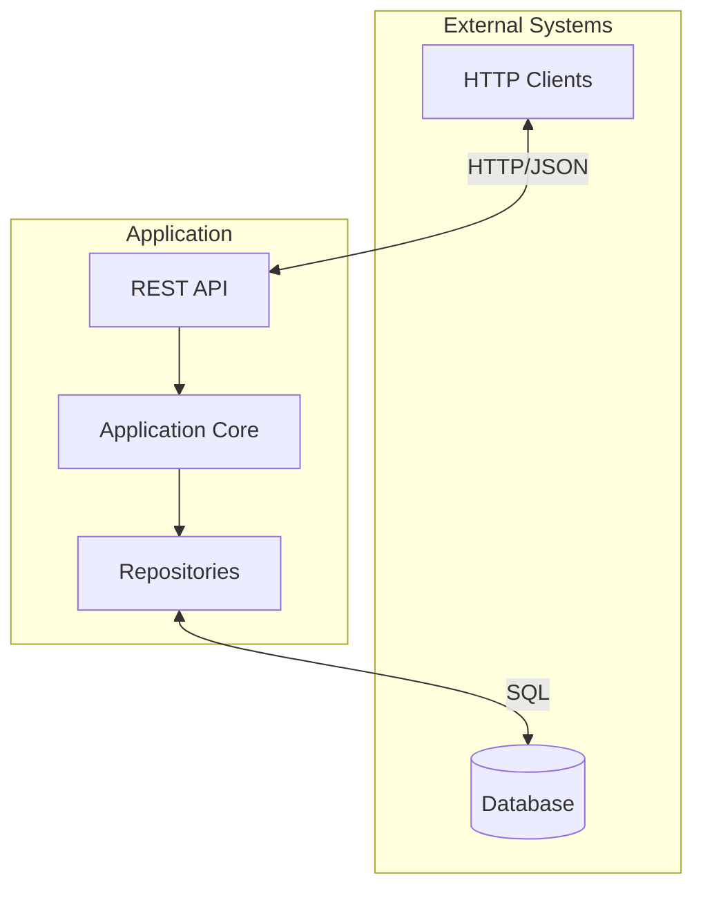

# System Context

This document describes how the application fits within its environment, including external interfaces, runtime considerations, and integration patterns.

## External Interfaces



### HTTP API

The application exposes a REST API via Hono framework:

- **Protocol**: HTTP/HTTPS
- **Format**: JSON request/response bodies
- **Authentication**: (Feature-specific, see auth module)

### Database

- **Query Builder**: Kysely for type-safe SQL queries
- **Pattern**: Repository pattern abstracts database access
- **Conventions**: snake_case column names, soft deletion

## Deno Runtime Environment

### Security Model

Deno runs with explicit permissions. The application requires:

| Permission | Flag | Purpose |
|------------|------|---------|
| Network | `--allow-net` | HTTP server, database connections |
| Environment | `--allow-env` | Configuration via environment variables |
| System | `--allow-sys` | System information access |

```bash
# Development with all required permissions
deno task dev

# Production with minimal permissions
deno run --allow-net --allow-env ./src/server.ts
```

### TypeScript Support

Deno has built-in TypeScript support with no compilation step required. The project uses:

- Strict mode enabled
- JSX precompilation for Hono JSX support
- Import maps via `deno.json`

### Import Aliases

The project uses the `#/` alias for the `src/` directory:

```typescript
// Instead of relative paths
import { Result } from "../../../shared/domain/result.ts";

// Use import alias
import { Result } from "#/shared/domain/result.ts";
```

## Database Interaction with Kysely

### Query Builder Pattern

Kysely provides type-safe SQL query building:

```typescript
// Type-safe select
const users = await db
  .selectFrom("users")
  .select(["id", "email", "created_at"])
  .where("deleted_at", "is", null)
  .execute();

// Type-safe insert
await db
  .insertInto("users")
  .values({
    id: crypto.randomUUID(),
    email: "user@example.com",
    created_at: new Date(),
    updated_at: new Date(),
    deleted_at: null,
  })
  .execute();
```

### Repository Abstraction

Repositories encapsulate all database queries:

```typescript
interface UserRepository extends BaseRepository<User, CreateUserDTO, UpdateUserDTO> {
  findByEmail(email: string): Promise<Result<User | null, DomainError>>;
}
```

### Case Mapping

Database rows (snake_case) are mapped to entities (camelCase) using shared mappers:

```typescript
import { mapRowToEntity } from "#/shared/infrastructure/mappers/index.ts";

const row = await db.selectFrom("users").executeTakeFirst();
const user = mapRowToEntity<User>(row);
// row.created_at → user.createdAt
```

## API Boundaries

### Request Flow

1. HTTP request arrives at Hono handler (Presentation)
2. Handler parses request and calls use case (Application)
3. Use case validates input with Zod schema
4. Use case calls repository methods (Infrastructure)
5. Repository returns Result type
6. Use case returns Result to handler
7. Handler maps Result to HTTP response

### Error Mapping

Domain errors map to HTTP status codes:

| Domain Error | HTTP Status |
|--------------|-------------|
| `ValidationError` | 400 Bad Request |
| `NotFoundError` | 404 Not Found |
| `DatabaseError` | 500 Internal Server Error |
