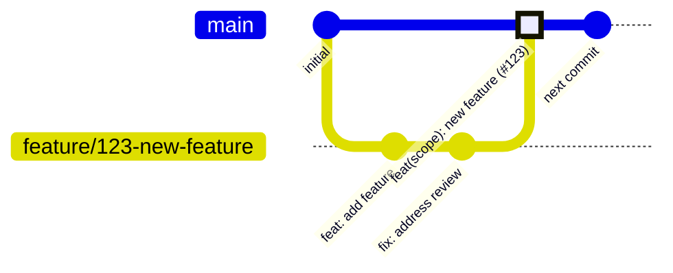

# Branching Rules

Git workflow and branch management guidelines.

## Branch Naming Conventions

| Type          | Pattern                                   | Example                            |
| ------------- | ----------------------------------------- | ---------------------------------- |
| Feature       | `feature/<ticket-id>-<short-description>` | `feature/123-user-authentication`  |
| Bug fix       | `fix/<ticket-id>-<short-description>`     | `fix/456-login-validation-error`   |
| Documentation | `docs/<short-description>`                | `docs/api-reference-update`        |
| Refactor      | `refactor/<short-description>`            | `refactor/user-repository-cleanup` |
| Hotfix        | `hotfix/<ticket-id>-<short-description>`  | `hotfix/789-critical-auth-bug`     |

### Naming Rules

- Use lowercase letters
- Use hyphens to separate words
- Keep descriptions short but descriptive
- Include ticket/issue ID when applicable

**DO:**

```
feature/123-add-password-reset
fix/456-handle-null-email
docs/update-readme
```

**DON'T:**

```
Feature/123-Add-Password-Reset    # Wrong case
feature/addPasswordReset          # No hyphens, no ticket
my-branch                         # No type prefix
```

## Main Branch Protection

The `main` branch is protected with the following rules:

### Required Checks

- [ ] All CI status checks must pass
- [ ] At least 1 approving review required
- [ ] No unresolved review conversations
- [ ] Branch must be up to date with main

### Restrictions

- [ ] No direct pushes to main
- [ ] No force pushes
- [ ] No branch deletion
- [ ] Administrators are not exempt

## Merge Strategy

We use **squash and merge** for all pull requests.

### Why Squash and Merge?

- Keeps main branch history clean and linear
- Each PR becomes a single, atomic commit
- Easier to revert changes if needed
- PR title becomes the commit message

### Merge Process

1. Ensure all checks pass
2. Get required approvals
3. Update branch with main if needed
4. Click "Squash and merge"
5. Edit commit message if needed (defaults to PR title)
6. Confirm merge

## Branch Lifecycle

### Creating a Branch

```bash
# Start from updated main
git checkout main
git pull origin main

# Create feature branch
git checkout -b feature/123-new-feature
```

### Working on a Branch

```bash
# Make changes and commit
git add .
git commit -m "feat(scope): description"

# Push to remote
git push origin feature/123-new-feature
```

### Keeping Branch Updated

```bash
# Fetch latest changes
git fetch origin

# Rebase on main (preferred for clean history)
git rebase origin/main

# Or merge main (if rebase causes issues)
git merge origin/main
```

### After Merge

```bash
# Switch to main
git checkout main

# Pull latest
git pull origin main

# Delete local branch
git branch -d feature/123-new-feature

# Delete remote branch (usually done automatically)
git push origin --delete feature/123-new-feature
```

## Branch Cleanup

### Automatic Cleanup

- Remote branches are automatically deleted after PR merge
- Stale branches (no activity for 30 days) may be flagged for deletion

### Manual Cleanup

```bash
# List merged branches
git branch --merged main

# Delete merged local branches
git branch -d <branch-name>

# Prune remote tracking branches
git fetch --prune
```

## Workflow Diagram


